<div align="center">
  
</div>

<br />

```gdb
#0  0x00000001  soc_analyst        () at /career/soc.c:1
#1  0x00000002  binary_exploit     () at /research/pwn.c:1
#2  0x00000003  firmware_security  () at /future/embedded.c:1  <-- next
#3  0x00000004  space_security     () at /orbit/final.c:1      <-- destination

Program received signal SIGCURIOUS, Continuing.
```

<br />

**Currently building:** a lightweight EDR for Windows — ETW + kernel callbacks for telemetry, a Sigma-inspired detection engine mapped to MITRE ATT&CK, and process-injection detection via memory monitoring.

<br />

<div align="center">


</div>

<br />

<div align="center">
<sub>

[GitHub](https://github.com/Ret2Voidx)

</sub>
</div>

<div align="center">
<sub>// still unwinding.</sub>
</div>
