  

 

  

 

  

 

**Currently building** — a lightweight EDR for Windows

ETW telemetry · Sigma-inspired detection engine mapped to MITRE ATT&CK · process-injection detection via memory monitoring

 

 

[GitHub](https://github.com/Ret2Voidx)

// still unwinding.

